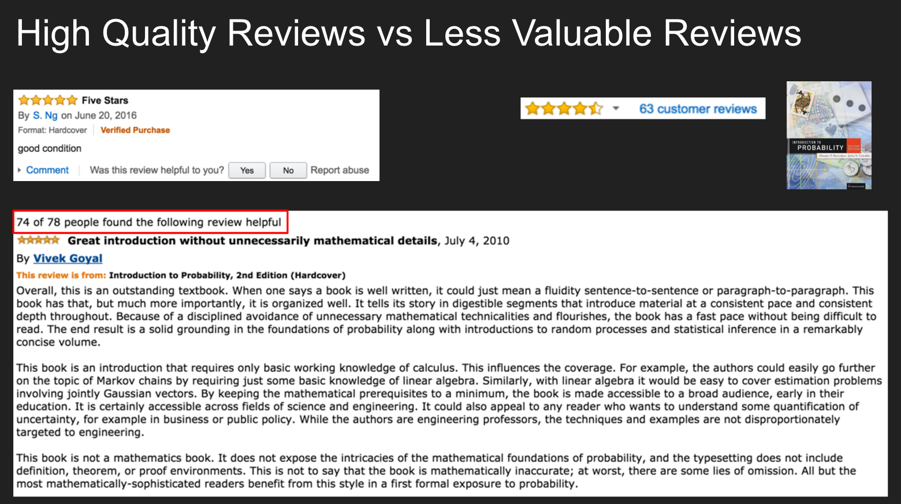
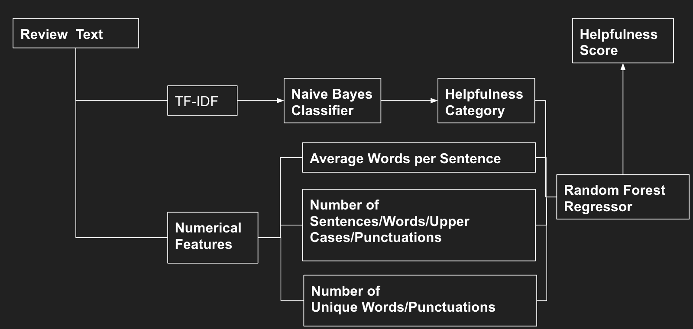

# Evaluate-Amazon-Book-Reviews

## Motivation
The ratings from users who have consumed the products act as a good reference for future buyers. The current Amazon rating system considers the age of review, helpful votes and whether the reviews come from verified perchases, but not the review quality. For those high quality reviews with detailed explanation of why the user likes or dislikes the product should have higher weight than those reviews with few words. On the other hand, it is nice to put high quality reviews on top of low quality ones, for the convenience of potential buyers. The helpful votes ratio is a good indicator of review quality. However, only about 12 percent of Amazon book reviews have more than 8 votes. The majority of them, either have no vote at all, or only few votes, which doesn't tell much how helpful the reviews are. Based on the above considerations, we use the ratio of helpful votes, i.e., number of people who found the reviews are helpful / total number of votes for the product, as the metric to evaluate the quality of reviews (helpfulness score), and design machine learning model to predict the helpfulness score. The helpfulness score can then act as the weight for the corresponding review and each weighted ratings will be a reference for the overall rating of each book.

## Example of Amazon Book Review
The following shows two examples of Amazon book reviews, where the one on the top says nothing about the book content and the one at the bottom explains very well why the reviewer likes the book. While both reviewers rate five stars for the book, the one with a better review quality should be counted with a higher wight. Also, most people who have read the review found it is helpful, which indicates the ratio of the helpful votes is a reasonable metric to evaluate the quality of reviews.

## Modeling
Our data consists of over 25,000,000 Amazon book reviews and the corresponding helpful vote pairs (number of people who found the review is helpful and total number of reviews). 
TF-IDF converts the review text into digital matrix, which is used to train Naive Bayes Classifier for an initial evaluation of whether the review is helpful or not, i.e. provides a categorical features for random forest regressor. Also, such nemerical features as average words per sentence, number of sentences and unique punctuations and so on, are sent to random forest regressor to train the model which gives a helpfulness score ranging from 0 to 1. 
Here is our model:

## Web App

The following is the interface of the app designed for the users to interact with the algorithm and evaluate the quality of reviews:

## References
[1] Image-based recommendations on styles and substitutes
J. McAuley, C. Targett, J. Shi, A. van den Hengel
SIGIR, 2015

[2] Inferring networks of substitutable and complementary products
J. McAuley, R. Pandey, J. Leskovec
Knowledge Discovery and Data Mining, 2015

